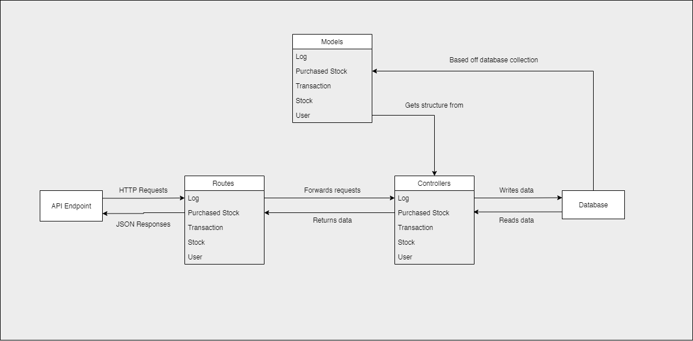
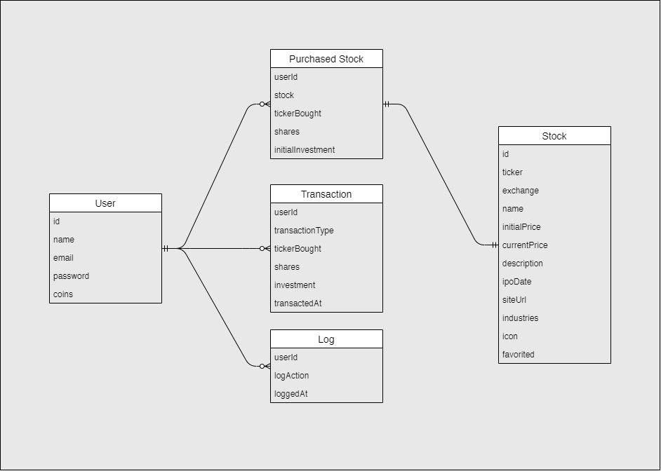

# MindworksAI API

To run this application locally, you will need the following prerequisite programs:

- [Node.JS and NPM](https://nodejs.org/en/)
- [Create React App](https://github.com/facebook/create-react-app)
- [MongoDB](https://www.mongodb.com/)

**Back-End Architecture**

[MVC-like](https://codedec.com/tutorials/workflow-and-folder-structure-for-mern-application/) architecture for manipulating, reading and writing data to the database, returning it as JSON responses to the frontend.



**Database Architecture**

MongoDB database structure following [normalized data models.](https://docs.mongodb.com/manual/core/data-model-design/#normalized-data-models)



**Back-End Setup**

First, install the necessary packages via:

```
npm install
```

Now you can spin up the backend. Default port is `3004`. 

```bash
# start server
npm run dev
```

